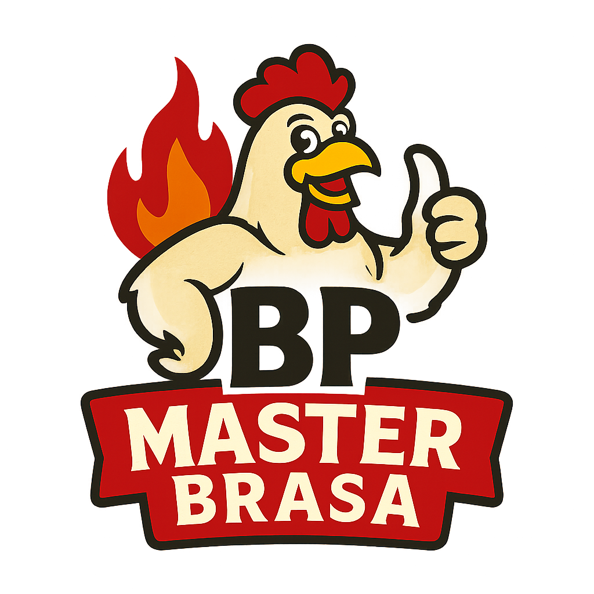

# 🎬 Animación de Apertura - Pollos a la Brasa

## ✨ Descripción de la Animación

Se ha agregado una **animación fluida y visual** que se ejecuta cuando el usuario entra a la página. La animación consiste en:

### 🎭 Secuencia de Animación

1. **Cortinas Naranjas que se Abren** (0s - 1.5s)
   - Las cortinas de los lados izquierdo y derecho se abren simultáneamente
   - Uso de gradiente naranja (#FF6B35 a #FF8C42) para un efecto visual mejorado
   - Movimiento suave con easing `cubic-bezier`

2. **Logo Revelado** (0.2s - 1.5s)
   - El logo de la empresa aparece en el centro de la pantalla
   - Animación de escala y rotación para mayor impacto
   - El logo sale del centro hacia arriba con sombra visual

3. **Contenido de la Página Visible** (0.7s - 2s)
   - La página principal (header, tabs, formularios, etc.) aparece con fade-in
   - Movimiento suave desde abajo hacia arriba
   - Transición elegante y profesional

### ⏱️ Timeline de Animación

```
0.0s ────────────────────────────────────────── Inicio
       ↓ Cortinas comienzan a abrirse
0.2s ──→ Logo aparece y sube
       ↓ Cortinas completamente abiertas
1.5s ────────────────────────────────────────── Fin de animaciones
       ↓ Overlay comienza a desaparecer
1.8s ──→ Overlay se vuelve transparente
2.2s ────────────────────────────────────────── Overlay removido del DOM
```

## 🎨 Características Visuales

### Colores Utilizados
- **Naranja Principal**: #FF6B35 (var(--primary))
- **Naranja Secundario**: #FF8C42
- Gradiente de izquierda a derecha en ambas cortinas

### Efectos
- **Sombra del Logo**: `drop-shadow(0 15px 40px rgba(255, 107, 53, 0.4))`
- **Fondo del Logo**: Blanco con border-radius para efecto moderno
- **Box Shadow**: Sombra suave para profundidad

### Animaciones CSS
- `openCurtainLeft`: Escala X (scaleX) de 1 a 0
- `openCurtainRight`: Escala X (scaleX) de 1 a 0
- `scaleUpLogo`: Escala y rotación con efecto de rebote
- `fadeInContent`: Fade-in suave del contenido
- `slideInUp`: Deslizamiento desde abajo

## 🔧 Implementación Técnica

### Elementos HTML Agregados
```html
<!-- Overlay de apertura con animación -->
<div class="opening-overlay" id="openingOverlay">
    <div class="curtain-left"></div>
    <div class="curtain-right"></div>
    <div class="logo-reveal" id="logoReveal">
        
    </div>
</div>

<!-- Contenido principal (ahora envuelto) -->
<div class="page-content" id="pageContent">
    <!-- Contenido original de la página -->
</div>
```

### Estilos CSS Principales
```css
.curtain-left / .curtain-right {
    animation: 1.5s cubic-bezier(0.25, 0.46, 0.45, 0.94)
}

.logo-reveal {
    animation: 1.5s cubic-bezier(0.34, 1.56, 0.64, 1)
}

.page-content {
    animation: 1s ease-in 0.7s + 0.8s ease-out 0.8s
}
```

### JavaScript
```javascript
// Se ejecuta cuando el DOM está listo
- Espera 1.8s para que terminen las animaciones
- Hace transparente el overlay (0.3s de transición)
- Remueve el overlay del DOM después de 2.2s
```

## 📱 Responsividad

La animación funciona correctamente en:
- ✅ Escritorio (cualquier resolución)
- ✅ Tablet (768px en adelante)
- ✅ Móvil (480px en adelante)
- ✅ Pantallas ultra-anchas

El overlay se ajusta al 100% del viewport automáticamente.

## 🎯 Ventajas de la Implementación

1. **Sin Dependencias Externas**: Todo hecho con CSS3 puro y JavaScript vanilla
2. **Rendimiento Optimizado**: Usa `transform` y `opacity` para mejor performance
3. **Accesibilidad**: El contenido es accesible después de la animación
4. **User Experience**: Animación suave que cautiva la atención
5. **Branding**: Incorpora los colores corporativos (naranja)

## 🚀 Cómo Funciona

1. Al cargar la página, se muestra el overlay con las cortinas
2. Automáticamente, las cortinas se abren (1.5 segundos)
3. El logo aparece en el centro con efecto de escala y rotación
4. Después de 1.8 segundos, el contenido principal se muestra
5. El overlay se desvanece suavemente y se remueve del DOM

## 📝 Nota Importante

- El archivo `logo.png` debe estar en la misma carpeta que `index.html`
- Si deseas ajustar los tiempos, edita los valores en las animaciones CSS
- Para cambiar los colores, actualiza los gradientes en `.curtain-left` y `.curtain-right`

## ✅ Resultado Final

Una experiencia de usuario premium con una animación fluida que:
- ✨ Hace que la página sea más atractiva
- 🎭 Crea una primera impresión profesional
- 🎯 Mantiene la atención del usuario
- 🚀 Demuestra calidad y cuidado en los detalles

¡Que disfrutes de la nueva animación! 🎉
